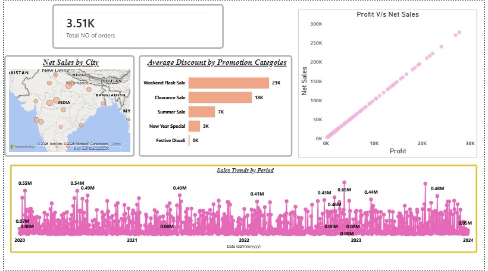
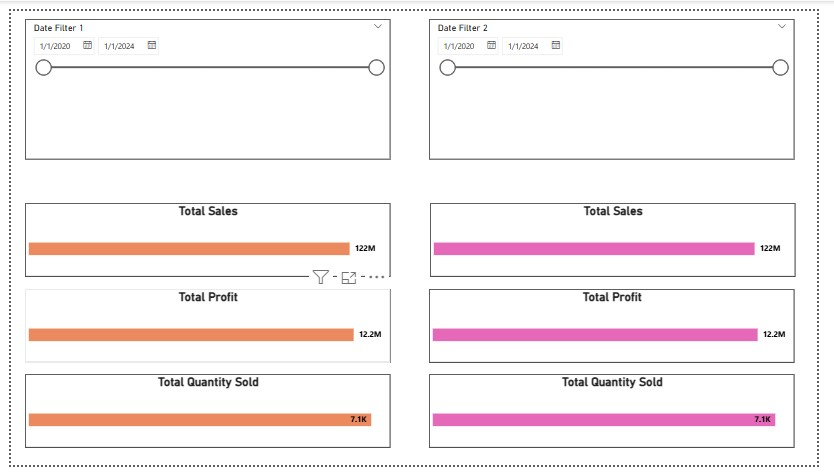
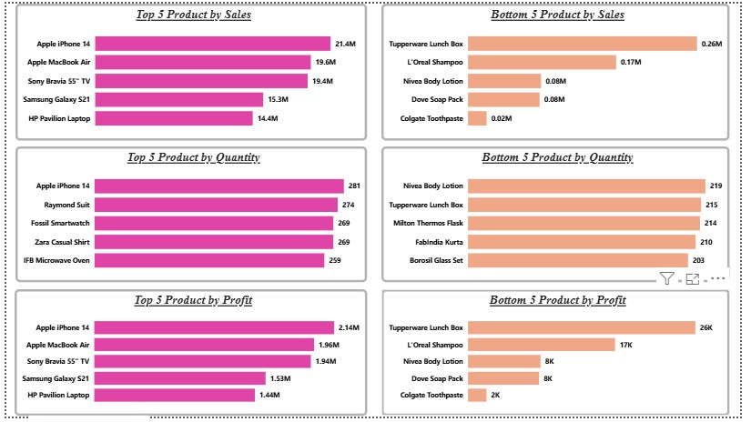
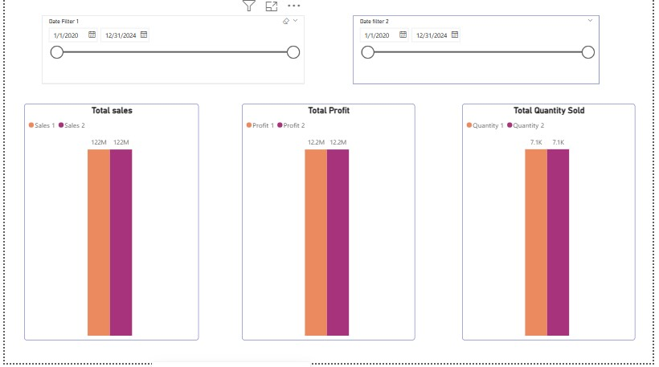
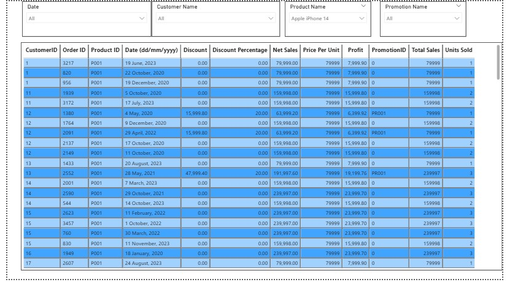

# 📊 Sales Analysis Dashboard | Power BI

## 📌 Project Overview

The **Sales Analysis Dashboard** is an interactive Power BI project developed to analyze sales performance, profit, customer purchasing behavior, product performance, and promotional effectiveness.

This dashboard helps business users monitor KPIs, identify top and low-performing products, compare sales across cities, analyze promotional campaigns, and explore detailed transaction-level data through interactive filters.

> **Note:** This project was created as part of my Power BI learning journey by following a guided YouTube/Udemy tutorial. I built the complete dashboard myself to practice Power BI, Power Query, DAX, and dashboard design.

---

# 🎯 Objectives

The main objectives of this project are:

- Analyze overall sales performance.
- Monitor total sales, profit, and quantity sold.
- Compare sales across different cities.
- Identify Top 5 and Bottom 5 products.
- Evaluate promotional campaign performance.
- Analyze sales trends over time.
- Compare two different time periods.
- Build an interactive dashboard for business decision-making.

---

# 🛠 Tools & Technologies

- Microsoft Power BI
- Microsoft Excel
- Power Query
- DAX (Data Analysis Expressions)
- Data Modeling

---

# 📂 Dataset

**File:** `Sales-Data.xlsx`

The dataset contains:

- Customer Information
- Product Details
- Orders
- Sales
- Profit
- Quantity Sold
- Promotions
- Discounts
- Cities
- Dates

---

# 📈 Dashboard Features

### KPI Cards

- Total Sales
- Total Profit
- Total Quantity Sold
- Total Number of Orders

### Sales Analysis

- Sales Trend Over Time
- Profit vs Net Sales Analysis
- Net Sales by City
- Promotion-wise Discount Analysis

### Product Analysis

- Top 5 Products by Sales
- Bottom 5 Products by Sales
- Top 5 Products by Profit
- Bottom 5 Products by Profit
- Top 5 Products by Quantity
- Bottom 5 Products by Quantity

### Comparison Analysis

- Compare Total Sales
- Compare Total Profit
- Compare Quantity Sold
- Compare Two Different Date Ranges

### Detailed Transaction Report

- Customer Details
- Order Details
- Product Details
- Discount Information
- Promotion Details
- Sales and Profit Records

---

# 📊 Dashboard Preview

## 📄 Page 1 - Sales Overview

- Total Orders KPI
- Net Sales by City
- Average Discount by Promotion
- Profit vs Net Sales
- Sales Trend by Period



---

## 📄 Page 2 - Date Comparison Dashboard

Compare business performance between two different date ranges.

Includes:

- Total Sales Comparison
- Total Profit Comparison
- Quantity Sold Comparison



---

## 📄 Page 3 - Product Performance Analysis

Displays:

- Top 5 Products by Sales
- Bottom 5 Products by Sales
- Top 5 Products by Quantity
- Bottom 5 Products by Quantity
- Top 5 Products by Profit
- Bottom 5 Products by Profit



---

## 📄 Page 4 - Sales Comparison Dashboard

Compare:

- Sales
- Profit
- Quantity Sold

between two selected periods.



---

## 📄 Page 5 - Transaction Details

Interactive transaction table with filters for:

- Date
- Customer
- Product
- Promotion

Includes detailed sales records for business analysis.



---

# 🔍 Key Insights

- Apple iPhone 14 generated the highest sales and profit.
- Weekend Flash Sale offered the highest average discount.
- Sales performance varies significantly across different cities.
- Business experienced fluctuating sales trends throughout the years.
- Some products consistently underperformed and require attention.
- Promotional campaigns significantly influenced sales performance.

---

# 📁 Repository Structure

```
Sales-Analysis
│
├── README.md
├── Sales-Analysis-Dashboard.pbix
├── Sales-Data.xlsx
│
└── Image
    ├── Page-1.jpg
    ├── Page-2.jpg
    ├── Page-3.jpg
    ├── Page-4.jpg
    └── Page-5.jpg
```

# 👨‍💻 Author

**Yogendra Singh**

Aspiring Data Analyst

### Skills

- Power BI
- SQL
- Excel
- Python
- Power Query
- DAX
- Data Visualization

---

## ⭐ If you found this project useful, please give it a Star.
